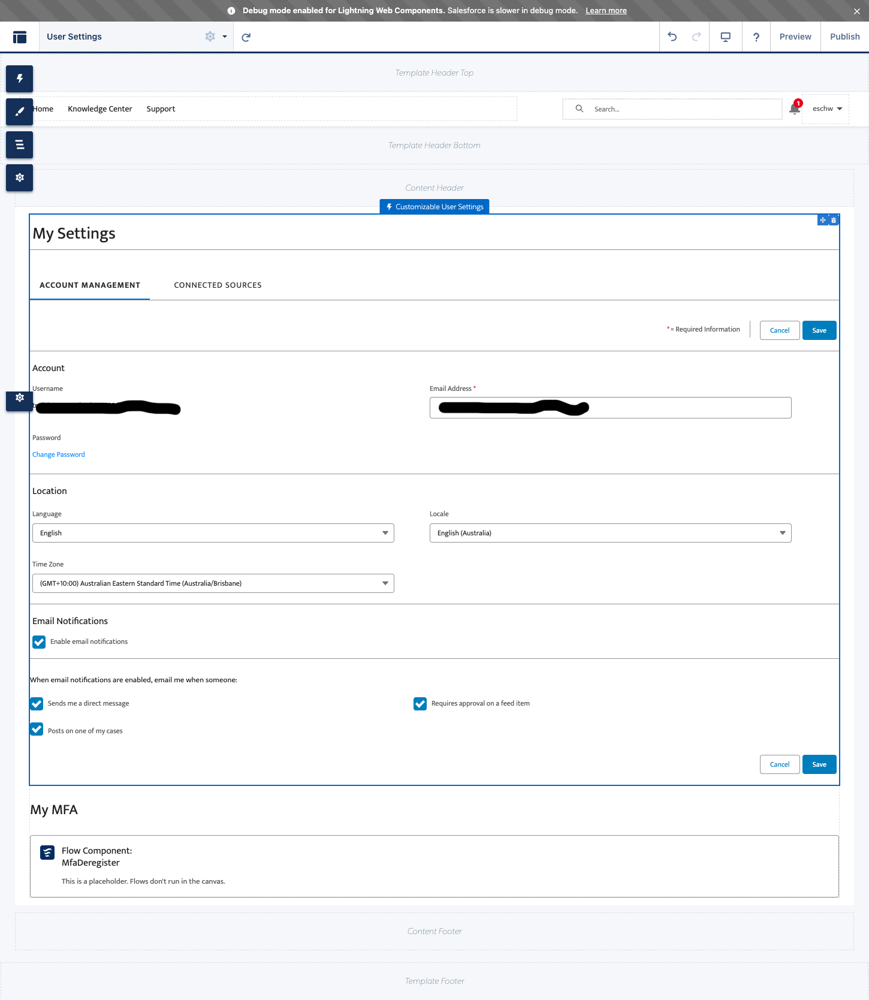

# sfdc-mfa-deregistration

The way users can switch MFA method is by:
- de-registering their current method,
- re-logging in
- registering a new MFA method.

This project has the artefacts required to let you present a user with the list of their MFA registered methods and deregister them. They then need to log out and log in back using the next-best MFA method. If no method is remaining, they will be prompted to register a new method.

Warning: from a security standpoint, it's not a great idea to let users de-register in self-service as an ill-intentioned actor who gains access to a user's account (e.g. physical access of their web session on an unlocked computer) could reduce that user's protection by removing that factor...

This exemple could be much enhanced by adding 2FA validation before de-registering, e.g. by leveraging [UserManagement.initVerificationMethod](https://developer.salesforce.com/docs/atlas.en-us.apexref.meta/apexref/apex_class_System_UserManagement.htm).

## List of artefacts

### Flow: MfaDeregister

Assumes this is done as a self-service by the user that wants to deregister. 
Presents the list of known registration methods, and lets the user pick one.
Deregisters that method and circles back to the first screen.

Place this flow e.g. in the User Settings screen of your Experience Cloud site, but this could be alternatively any page you find relevant in your Information Architecture.

### Apex: MfaDeregister

Callable from Flow. Deregisters a given MFA method (see [MfaMethod](#mfa-method) below) for a given user.
Since it's built as an invocable method, it will receive a list of Mfa methods.

### Apex: MfaGetRegistrationMethods

Callable from Flow. Returns a list of registration methods for a given user.
Since it's built an an invocable method, it will receive a list of users, and return a list of registration method lists.

### Apex: MfaMethod \{# #mfa-method\}

A data class that can be used in Flow as Apex-defined. Holds a registration method.
